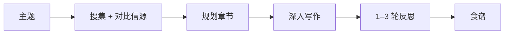

# 前言 —— 请替换本章

这是 cookbook-forge 模板自带的占位章节，好让你一打开就能看到成书的样子。**请删掉它，写入真正的章节。** 它同时也是一页速查表，演示渲染器支持的 Markdown 能力。

> 一句点题的引文或主张能定下基调。引用块左侧带强调竖线——用它为一章开个有力的头。

## 标题会进入右侧目录

每个 `##` 和 `###` 标题都会自动生成锚点，并列入右侧「本页目录」。标题要短、要好扫读。大约每几百字一个标题，读者就不会迷路。

## 你能用到的排版元素

正文承载论证；**表格、列表、提示块、图示**承载结构。一章写得密实，靠的就是在它们之间不断切换。

一张表把对比压缩得比三段文字更清楚：

| 元素 | 何时使用 | 渲染说明 |
|---|---|---|
| 表格 | 在共同维度上对比多个选项 | 过宽时在列内横向滚动 |
| 提示块 | 打断正文的警告、技巧或旁注 | 有 `tip` / `warn` / `info` 三种 |
| Mermaid | 流程、层级或关系 | 用 ` ```mermaid ` 围栏代码块 |
| 代码卡 | 读者可能复制的内容 | 自带复制按钮 + 语法高亮 |

提示块把要点从正文里拎出来。把内容写成**用空行分隔的 Markdown，放在 `div` 内部**（空行很关键）：

<div class="callout tip">

**技巧。** 提示块以加粗标签开头。`tip` 给建议，`warn` 标陷阱，`info` 作中性旁注。别滥用——每章三个足矣。

</div>

<div class="callout warn">

**陷阱。** 满屏提示块读起来像警告标签，不像一本书。处处高亮，等于没有重点。

</div>

围栏代码块会变成可复制的「代码卡」，并带语言标签：

```javascript
// 真实、可运行、最小。优先给读者能直接粘贴试跑的例子。
function greet(name) {
  return `你好，${name}`
}
```

Mermaid 代码块则渲染成图示——最适合画流程或决策：



## 一章真正该做的事

讲透一个想法：摆出问题、给出具体例子、解释机制、点出边界情况，最后说清**何时不该**用它。深度优先于广度——读者读完一章，应当能**动手做**某件事，而不只是认得一个术语。

替换本文件，在 `manifest.json` 里列出你的章节，运行 `node build.mjs`，然后打开 `index.html`。
