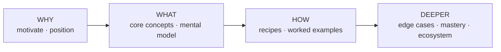

# Chapter Blueprint — Planning the Table of Contents

A cookbook's spine is its structure. The wrong outline produces a glossary; the
right one produces a path from "never heard of it" to "can do it." This file
gives you a **preset catalog of chapter archetypes** as a starting palette, and a
**method** for selecting and ordering them for a specific topic.

> The preset list is a primer, not a template. Most topics need 60–80% of these
> plus 1–3 archetypes unique to the domain. Never ship the default order
> unexamined — a TOC that could front any book fronts none well.

## The arc every good cookbook follows

Regardless of topic, strong instructional books move through four pressures:



- **Why** — Why does this exist? What pain does it kill? Where does it sit among
  alternatives? (Earns the reader's attention; prevents "so what?")
- **What** — The mental model and vocabulary. The smallest set of concepts that
  makes everything else click.
- **How** — Concrete, runnable, real recipes. The heart of a *cookbook*.
- **Deeper** — Edge cases, anti-patterns, scaling, tooling, comparisons,
  authoring your own. Turns competence into mastery.

Order parts along this arc. Within a part, order chapters by dependency: nothing
should require a concept the reader hasn't met yet.

## Preset chapter archetypes (the palette)

Pick from these; rename them in the topic's own language. Not all apply.

### Front matter
- **Preface / Why this book** — the thesis, who it's for, how to read it, an
  honest statement of scope and sourcing.
- **The 60-second tour** — one end-to-end example up front, so the reader sees
  the whole shape before the details.

### Part: Understanding (Why / What)
- **What it is** — definition, boundaries, what it is *not* (kill the common
  confusions explicitly).
- **Why it exists / the problem it solves** — the pain, told through a concrete
  failure of the old way.
- **Positioning / landscape** — how it relates to adjacent tools, approaches, or
  schools of thought. A comparison table or matrix earns its place here.
- **The mental model** — the one diagram or metaphor the rest of the book leans
  on. (Choose a metaphor that holds up under pressure, not a decorative one.)
- **Core concepts / anatomy** — the vocabulary and the parts, each defined once,
  precisely.

### Part: Foundations (What / How)
- **Your first &lt;thing&gt;** — the minimal complete example, built step by step.
- **The building blocks reference** — the core API / primitives / ingredients,
  each with a tiny example.
- **Configuration & options** — the knobs that matter, with defaults and when to
  turn them.
- **Inputs, outputs & contracts** — data shapes, interfaces, schemas, formats.

### Part: Recipes (How — the core of a cookbook)
- **Worked recipe** chapters — each solves one realistic problem end to end:
  problem statement → approach → full example → what the output looks like →
  variations → when not to use this. **Aim for several of these; they are why
  the book is called a cookbook.**
- **Patterns / idioms** — reusable shapes that recur across recipes.

### Part: Advanced / Mastery (Deeper)
- **Edge cases & failure modes** — what breaks, why, and how you'd know.
- **Performance / scaling / cost** — behavior under size and load.
- **Anti-patterns & pitfalls** — the seductive wrong ways, named, with the fix.
- **Debugging & troubleshooting** — how to diagnose when it goes wrong.
- **Security / safety / correctness** — the hazards specific to the domain.

### Part: Ecosystem & Beyond (Deeper)
- **Comparisons / alternatives** — honest head-to-head with neighbors.
- **Extending it / building your own** — from consumer to author.
- **Integration** — how it lives alongside the rest of a real stack.
- **The road ahead** — where the topic is going (clearly marked as forward-looking).

### Appendices (reference, not narrative)
- **Quick reference / cheat sheet**, **Glossary**, **Sources & further reading**,
  **FAQ**, **Decision tables / scenario index**.

## The planning method

1. **Restate the topic as a learning goal.** "After this book the reader can ___."
   That sentence decides what's in scope and what's an appendix.

2. **Inventory what the sources actually support.** You can only write chapters
   you have grounded material for (see `research-method.md`). A planned chapter
   with no sources is a chapter you'll pad or fabricate — cut it or go find the
   material first.

3. **Draft the parts along the Why→What→How→Deeper arc.** Assign each candidate
   chapter to a part. Expect 4–6 parts and roughly 8–24 chapters depending on
   topic breadth — but let the topic decide, not a quota.

4. **Add the topic-specific archetypes.** Every domain has 1–3 chapters no
   generic list predicts (e.g. "the determinism rule" for a workflow engine,
   "color theory" for a design tool, "the type system" for a language). These
   are often the most valuable chapters. Find them by asking: *what does an
   expert know that a novice keeps getting wrong?*

5. **Order by dependency, then by motivation.** A chapter may only use concepts
   introduced earlier. Among chapters with no dependency between them, lead with
   the one that best motivates the next.

6. **Pressure-test the outline before writing a word:**
   - Could a reader who finishes Part *n* actually attempt Part *n+1*? (gap check)
   - Does every chapter earn its place, or do two collapse into one? (redundancy)
   - Is the *How* part the biggest? In a cookbook it should be. (balance)
   - Remove the title of each chapter — can you still tell them apart by promise?
     (distinctness)

7. **Write a one-line promise for each chapter** ("what you can do after this").
   If you can't, the chapter isn't ready to be in the plan.

8. **Confirm the plan with the user** before deep authoring (one round). Present
   the parts, chapter titles, and one-line promises. Cheap to reorder now,
   expensive later.

## Sizing guidance

- A **focused/narrow** topic: 1 part of understanding, 1 of foundations, a
  strong recipes part, a short mastery part. ~8–12 chapters.
- A **broad/deep** topic: the full arc, multiple recipe chapters, ecosystem and
  authoring parts, several appendices. ~20–30 chapters.
- Chapters should be **substantial but not sprawling** — roughly one sitting to
  read. If a chapter needs three sittings, it's two chapters. If five chapters
  read in two minutes each, some should merge.

---

## Inside a chapter — the internal structure template

Knowing which chapters to write is half the job. You also need to know what one
chapter looks like *inside*. The template below is distilled from a 29-chapter
production cookbook and is battle-tested.

### The five parts of one chapter

**Hook → Body (N numbered sections) → Summary → Bridge → Next-chapter link.**

#### 1. Opening hook (required)

Every chapter opens with a blockquote that does two things: state the thesis in
one bolded sentence, then locate the chapter in the wider book in 1–2 sentences.

```markdown
# 第 XX 章 · 章标题

> 一句话：**[本章核心论点，加粗，可独立成立]。**
>
> [1–2 句话解释本章教什么、为什么在这个位置出现、需要什么前置知识（或指向哪一章）。]
```

Worked example:

```markdown
# 第 01 章 · Workflow 是什么

> 一句话：**Workflow 是 Claude Code 内置的一个工具，让你用一段纯 JavaScript 脚本，确定性地编排任意多个 subagent。**
>
> 这一章不急着写复杂脚本。先把三件事讲透：它到底是个什么东西、运行时发生了什么、为什么值得专门花时间学——这是后面所有配方的地基。
```

#### 2. Body — numbered sections (X.1, X.2, …)

Number sections as `chapter.section` (chapter 10's third section is `## 10.3
标题`). Use H3 for sub-sections.

**Section 1 follows a fixed pattern — start from something concrete:**

```markdown
## X.1 从一次真实的 [具体事物] 说起

[A minimal, concrete example — code / output / screenshot / scenario]

[Then take it apart block by block]
```

Why: readers build a mental model faster from an example than from a definition.
Whole first, parts second.

**Later sections each add one layer of depth or introduce one new concept.**
Common section types:

| Section type | Purpose | Core visual elements |
|--------------|---------|---------------------|
| Concept | Introduce one core concept | Table of fields + mermaid of structure + `tip` callout for the key insight |
| Comparison | Help the reader pick between options | Comparison table + side-by-side mermaid + `info` callout with the decision rule |
| Anti-pattern | What not to do | Anti-pattern table (name / problem / correct alternative) + `warn` callout |
| Design notes | Justify the recipe's choices | Numbered bold list: **① 要点.** 1–3 sentence rationale |
| Variants | Variations on the main recipe | A single `info` callout, each variant a bolded sub-title + 1–2 sentences |

*Comparison-section skeleton:*

```markdown
## X.N [选择 A] vs [选择 B]：核心取舍

[一段话说清楚岔路口在哪]

| 维度 | 选择 A | 选择 B |
|------|--------|--------|
| 适用场景 | ... | ... |
| 成本 | ... | ... |
| 风险 | ... | ... |

[mermaid 并排对比图]

<div class="callout info">

**决策规则**：[帮读者做选择的一句话。]

</div>
```

*Variants-section skeleton:*

```markdown
## X.N 变体

<div class="callout info">

**变体 A · [名称]**：[1–2 句描述如何修改主配方以适应不同场景。]

**变体 B · [名称]**：[...]

**变体 C · [名称]**：[...]

</div>
```

#### 3. Chapter summary (required)

```markdown
## X.N 本章小结

- [要点 1——完整句子，脱离上下文也能独立阅读]
- [要点 2]
- [要点 3——引用具体数据]
- [要点 4]
- [要点 5——桥接到下一章的主题]
```

Discipline:
- 4–7 bullets.
- Each bullet is a **complete sentence**, not a fragment.
- First bullet restates the chapter's thesis.
- Last bullet pivots toward the next chapter.
- Include numbers wherever they exist.

#### 4. Bridge paragraph (required, between summary and next-chapter link)

Not "click here for the next chapter" — 1–2 prose sentences that tell the reader
**why** to keep going. Engineer the page-turn.

Worked example:

```markdown
下一章换个角度：先不聊 API，聊聊**为什么**——Workflow 还没出现的时候，大家是怎么手动编排多 Agent 的、又踩过哪些坑，搞明白「确定性编排」到底解决了什么真问题。

> 继续阅读：[第 02 章 · 为什么需要确定性编排](#/p1-02)
```

#### 5. Cross-references (throughout the chapter)

Link as you write:

```markdown
（见第 X 章对此概念的基础讲解）        ← backward reference
（第 Y 章会详细展开这个模式）          ← forward reference
（完整参考见附录 A）                  ← appendix reference
```

Every chapter should reference at least two other chapters. This makes the book
read as a **network**, not a string of isolated essays.

### Full chapter skeleton — copy and fill in

```markdown
# 第 XX 章 · [标题]

> 一句话：**[核心论点]。**
>
> [定位与上下文]

---

## X.1 从一个真实的 [具体事物] 说起

[最小具体例子]

[逐块拆解]

---

## X.2 [核心概念]

[讲解 + 图表]

| 要素 | 说明 |
|------|------|
| ... | ... |

<div class="callout tip">

**[洞察].** [为什么重要。]

</div>

---

## X.3 [深化 / 对比]

[更深入的讲解或两种方案的对比]


<div class="callout warn">

**[警告].** [什么会出问题。]

</div>

---

## X.4 [实践 / 应用]

[代码示例或实际应用场景]

---

## X.5 设计要点

**① [要点].** [理由。]
**② [要点].** [理由。]

---

## X.6 本章小结

- [论点重述]
- [关键概念 1]
- [关键概念 2]
- [数据点]
- [向下一章过渡]

[桥接段落——叙述性地引出下一章]

> 继续阅读：[第 XX+1 章 · 下一章标题](#/pN-XX)
```
