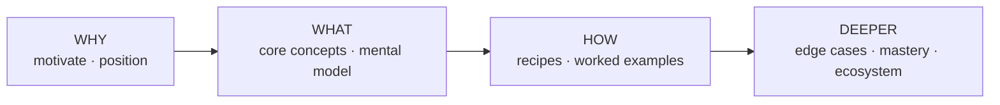

# Chapter Blueprint — Planning the Table of Contents

A cookbook's spine is its structure. The wrong outline produces a glossary; the
right one produces a path from "never heard of it" to "can do it." This file
gives you a **preset catalog of chapter archetypes** as a starting palette, and a
**method** for selecting and ordering them for a specific topic.

> The preset list is a primer, not a template. Most topics need 60–80% of these
> plus 1–3 archetypes unique to the domain. Never ship the default order
> unexamined — a TOC that could front any book fronts none well.

## The arc every good cookbook follows

Regardless of topic, strong instructional books move through four pressures:

- **Why** — Why does this exist? What pain does it kill? Where does it sit among
  alternatives? (Earns the reader's attention; prevents "so what?")
- **What** — The mental model and vocabulary. The smallest set of concepts that
  makes everything else click.
- **How** — Concrete, runnable, real recipes. The heart of a *cookbook*.
- **Deeper** — Edge cases, anti-patterns, scaling, tooling, comparisons,
  authoring your own. Turns competence into mastery.

Order parts along this arc. Within a part, order chapters by dependency: nothing
should require a concept the reader hasn't met yet.

## Preset chapter archetypes (the palette)

Pick from these; rename them in the topic's own language. Not all apply.

### Front matter
- **Preface / Why this book** — the thesis, who it's for, how to read it, an
  honest statement of scope and sourcing.
- **The 60-second tour** — one end-to-end example up front, so the reader sees
  the whole shape before the details.

### Part: Understanding (Why / What)
- **What it is** — definition, boundaries, what it is *not* (kill the common
  confusions explicitly).
- **Why it exists / the problem it solves** — the pain, told through a concrete
  failure of the old way.
- **Positioning / landscape** — how it relates to adjacent tools, approaches, or
  schools of thought. A comparison table or matrix earns its place here.
- **The mental model** — the one diagram or metaphor the rest of the book leans
  on. (Choose a metaphor that holds up under pressure, not a decorative one.)
- **Core concepts / anatomy** — the vocabulary and the parts, each defined once,
  precisely.

### Part: Foundations (What / How)
- **Your first &lt;thing&gt;** — the minimal complete example, built step by step.
- **The building blocks reference** — the core API / primitives / ingredients,
  each with a tiny example.
- **Configuration & options** — the knobs that matter, with defaults and when to
  turn them.
- **Inputs, outputs & contracts** — data shapes, interfaces, schemas, formats.

### Part: Recipes (How — the core of a cookbook)
- **Worked recipe** chapters — each solves one realistic problem end to end:
  problem statement → approach → full example → what the output looks like →
  variations → when not to use this. **Aim for several of these; they are why
  the book is called a cookbook.**
- **Patterns / idioms** — reusable shapes that recur across recipes.

### Part: Advanced / Mastery (Deeper)
- **Edge cases & failure modes** — what breaks, why, and how you'd know.
- **Performance / scaling / cost** — behavior under size and load.
- **Anti-patterns & pitfalls** — the seductive wrong ways, named, with the fix.
- **Debugging & troubleshooting** — how to diagnose when it goes wrong.
- **Security / safety / correctness** — the hazards specific to the domain.

### Part: Ecosystem & Beyond (Deeper)
- **Comparisons / alternatives** — honest head-to-head with neighbors.
- **Extending it / building your own** — from consumer to author.
- **Integration** — how it lives alongside the rest of a real stack.
- **The road ahead** — where the topic is going (clearly marked as forward-looking).

### Appendices (reference, not narrative)
- **Quick reference / cheat sheet**, **Glossary**, **Sources & further reading**,
  **FAQ**, **Decision tables / scenario index**.

## The planning method

1. **Restate the topic as a learning goal.** "After this book the reader can ___."
   That sentence decides what's in scope and what's an appendix.

2. **Inventory what the sources actually support.** You can only write chapters
   you have grounded material for (see `research-method.md`). A planned chapter
   with no sources is a chapter you'll pad or fabricate — cut it or go find the
   material first.

3. **Draft the parts along the Why→What→How→Deeper arc.** Assign each candidate
   chapter to a part. Expect 4–6 parts and roughly 8–24 chapters depending on
   topic breadth — but let the topic decide, not a quota.

4. **Add the topic-specific archetypes.** Every domain has 1–3 chapters no
   generic list predicts (e.g. "the determinism rule" for a workflow engine,
   "color theory" for a design tool, "the type system" for a language). These
   are often the most valuable chapters. Find them by asking: *what does an
   expert know that a novice keeps getting wrong?*

5. **Order by dependency, then by motivation.** A chapter may only use concepts
   introduced earlier. Among chapters with no dependency between them, lead with
   the one that best motivates the next.

6. **Pressure-test the outline before writing a word:**
   - Could a reader who finishes Part *n* actually attempt Part *n+1*? (gap check)
   - Does every chapter earn its place, or do two collapse into one? (redundancy)
   - Is the *How* part the biggest? In a cookbook it should be. (balance)
   - Remove the title of each chapter — can you still tell them apart by promise?
     (distinctness)

7. **Write a one-line promise for each chapter** ("what you can do after this").
   If you can't, the chapter isn't ready to be in the plan.

8. **Confirm the plan with the user** before deep authoring (one round). Present
   the parts, chapter titles, and one-line promises. Cheap to reorder now,
   expensive later.

## Sizing guidance

- A **focused/narrow** topic: 1 part of understanding, 1 of foundations, a
  strong recipes part, a short mastery part. ~8–12 chapters.
- A **broad/deep** topic: the full arc, multiple recipe chapters, ecosystem and
  authoring parts, several appendices. ~20–30 chapters.
- Chapters should be **substantial but not sprawling** — roughly one sitting to
  read. If a chapter needs three sittings, it's two chapters. If five chapters
  read in two minutes each, some should merge.
